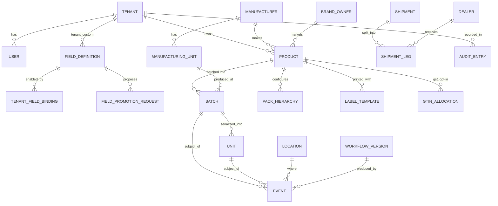

# Data Model / Schema Document

| | |
|---|---|
| **Version** | v0.1 (initial draft) |
| **Status** | Draft — for review |
| **Date** | 2026-06-21 |
| **Companion docs** | `docs/PRD.md` (behaviour), `docs/architecture.md` (topology, RLS, meta-model), `docs/decisions.md` (decisions), `docs/datakart-gs1-analysis.md` (GS1 mechanics) |

> This document specifies the **logical data model**: entities, columns, relationships, the meta-model that powers configurable fields, and the partitioning/indexing strategy. It is the bridge between the PRD's behaviour and the eventual concrete DDL/migrations. Where a choice is binding it is flagged **[PROPOSED]** for sign-off; physical DDL and migration order come in a follow-up.

---

## 1. Purpose & modelling principles

Every choice here serves the CLAUDE.md invariants:

| Invariant | Modelling rule |
|---|---|
| UUID-internal identity | Every table's PK is `id uuid` (`gen_random_uuid()` / UUIDv7 for time-ordered). GTIN/batch/serial are **validated attribute columns**, never PKs or FKs. |
| Versioned, append-only config | Configurable entities (fields, workflows, labels, rules) use **version rows**; history rows are immutable. A hash-chained `audit_entry` records every mutation. |
| Strict typing | `field_definition.data_type` + `validation` (JSON Schema) drive a compiled validator shared by client and server; bindings are type-checked. |
| Deactivate, never delete | `status` + `deactivated_at` everywhere; no hard deletes of business data. Historic reads resolve values against the **captured field version**. |
| Async engine | `event` rows carry `idempotency_key`; workflow execution state lives in Temporal, not the OLTP tables (only references are stored). |
| Tenant isolation | Every tenant-scoped table has `tenant_id uuid not null` + a **Row-Level Security** policy. |
| GTIN immutability | `product.committed_at` locks the six GTIN attributes; enforced by app + DB trigger. |
| Scale linearly | `tenant_id` is the shard seam; high-volume tables are **declaratively partitioned**. |

---

## 2. Conventions

### 2.1 Common columns (every table unless noted)

| Column | Type | Notes |
|---|---|---|
| `id` | `uuid` PK | `default gen_random_uuid()` (UUIDv7 preferred for hot tables to keep inserts locality-friendly). |
| `tenant_id` | `uuid` | NOT NULL on all tenant-scoped tables; FK → `tenant(id)`; RLS key. (Platform-global tables — `tenant`, `super` field defs — omit it or set a sentinel.) |
| `status` | `text`/enum | `active` / `deactivated` (+ entity-specific states). Never hard-delete. |
| `created_at` / `updated_at` | `timestamptz` | UTC; `updated_at` via trigger. |
| `created_by` / `updated_by` | `uuid` | FK → `user(id)`. |
| `row_version` | `int` | Optimistic-lock guard; bumped on update. |
| `deactivated_at` | `timestamptz` NULL | Set when soft-deactivated. |

### 2.2 RLS policy template

The application role is **not** superuser and does **not** have `BYPASSRLS`. Every request runs inside a transaction that first sets the tenant context:

```sql
-- once per table
ALTER TABLE <t> ENABLE ROW LEVEL SECURITY;
CREATE POLICY tenant_isolation ON <t>
  USING      (tenant_id = current_setting('app.tenant_id')::uuid)
  WITH CHECK (tenant_id = current_setting('app.tenant_id')::uuid);

-- per request (transaction-scoped → pooling-safe)
SET LOCAL app.tenant_id = '<uuid>';
```

Platform Super Admin cross-tenant access uses a separate, explicitly-audited role/policy branch (`app.role = 'platform'`), never an ambient bypass.

### 2.3 Naming & types

- snake_case tables/columns; singular table names. Enums as Postgres `enum` or `text + CHECK` (CHECK preferred for easy evolution).
- Money as `numeric(14,4)`; quantities `numeric`; geo as `geography(Point,4326)` (PostGIS, opt-in).
- Flexible per-tenant values live in a JSONB **`attributes`** column (see §4.3).

### 2.4 Logical schemas (within one database)

`identity` · `master_data` · `fields` (meta-model) · `trace` (events/batches/units) · `workflow` · `labels` · `notify` · `audit` · `gs1` (opt-in conformance). Schema split is by **domain**, not tenant (tenancy is RLS). This mirrors the modular-monolith module seams.

---

## 3. Identity & tenancy

### 3.1 `tenant` (identity schema, platform-global)

| Column | Type | Notes |
|---|---|---|
| `id` | uuid PK | |
| `name`, `slug` | text | slug unique |
| `tier` | text | low / mid / high (capacity profile) |
| `region` | text | data-residency region (DPDP) |
| `status` | text | active / suspended / onboarding |
| `settings` | jsonb | feature flags incl. `gs1_conformance_enabled`, FEFO per-product defaults |

### 3.2 `user`, `role`, `permission`, `user_role`

- `user` (tenant-scoped; platform users have `tenant_id = NULL` sentinel + `platform_scope`).
- `role` — Platform Super Admin / Platform Admin / Tenant Admin are seeded; Tenant Admin defines additional **tenant roles** (rows with `tenant_id`).
- `permission` — granular `(resource, action)` pairs (`product:create`, `field:deactivate`, `export:run`, plus per-workflow-stage scopes).
- `user_role` (M:N) and `role_permission` (M:N). A single reusable permission-resolver reads a `user_permissions_view` (borrowed pattern, §decisions 2026-06-21).
- **Identity governance:** `identity_event` append-only log (provision/activate/role-change/deactivate) feeds governance reports.

### 3.3 `identity_scheme`

| Column | Type | Notes |
|---|---|---|
| `id` | uuid PK | |
| `tenant_id` | uuid | |
| `kind` | text | `gtin` / `uuid` / `custom` |
| `config` | jsonb | for `gtin`: GS1 Company Prefix(es); for `custom`: regex/format |
| `scope` | text | tenant-wide or per-product-line |

The chosen scheme is a **validated attribute** on the UUID identity — never the storage key.

---

## 4. Meta-model & Field Library (the configurability engine)

### 4.1 `field_definition` (fields schema)

The heart of configurability. Core/Super defs are platform-global (`tenant_id NULL`); Tenant Custom defs carry `tenant_id`.

| Column | Type | Notes |
|---|---|---|
| `id` | uuid PK | stable across versions |
| `version` | int | **append-only**; edits create a new version row (same `id`, new `version`) |
| `tier` | text | `core` / `super` / `tenant_custom` |
| `tenant_id` | uuid NULL | NULL for core/super; set for tenant_custom |
| `entity` | text | `product` / `batch` / `unit` / `event` / `label` / … |
| `key` | text | machine name, e.g. `expiry_date` |
| `display_name` | text | |
| `data_type` | text | text, number, decimal, boolean, date, datetime, single_select, multi_select, file, gtin, batch_ref, unit_ref, geo, signature, rich_text |
| `validation` | jsonb | JSON-Schema fragment (required, regex, min/max, length, required_if) |
| `options` | jsonb | for selects |
| `derived` | jsonb NULL | formula spec for calculated fields |
| `status` | text | active / deactivated |
| `is_locked` | bool | true for Core (cannot deactivate) |

**Uniqueness:** `(entity, key, tier, tenant_id)` for the *current* version; version history retained.

### 4.2 `tenant_field_binding`, `field_promotion_request`

- `tenant_field_binding` — which **Super** fields a tenant enabled, and **per-tenant deactivations by Super Admin**: `(tenant_id, field_definition_id, enabled, deactivated_by_super)`.
- `field_promotion_request` — Tenant Custom → Super queue: `(tenant_id, proposed_def jsonb, status [pending/approved/rejected/needs_changes], rationale, decided_by, decided_at)`. On approval the field becomes a Super def and existing data migrates onto it.

### 4.3 The attribute-bag pattern (how entities store custom fields)

Each configurable entity has fixed core columns **plus**:

| Column | Type | Notes |
|---|---|---|
| `attributes` | jsonb | Super/Tenant-Custom values keyed by `field_definition.id` |
| `attribute_versions` | jsonb | parallel map `field_definition.id → version` captured at write time |

- **Validation:** for a given `(entity, tenant)` the active field defs compile into one JSON Schema (cached, invalidated on field version change); inbound `attributes` validated with Ajv at the API boundary **and** at the workflow `Validate` node.
- **Historic reads** resolve each value against the field version in `attribute_versions` (so a renamed/retyped field never corrupts history — the gap we saw in DataKart's mutate-in-place superfields).
- **Hot attributes** (e.g. `expiry_date`, `batch_number`) get expression / GIN indexes (§11).

---

## 5. Master data

### 5.1 `manufacturer`, `manufacturing_unit`, `brand_owner`

- `manufacturer` — legal name, registered address, licences (`licences jsonb`: FSSAI/drug/BIS with expiry + renewal-warning dates), optional `gln`, status.
- `manufacturing_unit` — belongs to a manufacturer (`manufacturer_id`), name, geocoded address, plant licences, optional `gln`, `plant_code` (tenant short code, usable in batch templates), status. **One manufacturer → many units.**
- `brand_owner` — same structure as manufacturer; used when marketer ≠ manufacturer.
- All three are **per-tenant** in v1 (PRD §5.6; shared library is v2).

### 5.2 `product` (master data + GTIN immutability)

| Column | Type | Notes |
|---|---|---|
| `id` | uuid PK | |
| `tenant_id` | uuid | |
| `identity_scheme_id` | uuid | which scheme this product uses |
| `gtin` | text NULL | validated (mod-10) when scheme=gtin; NULL for uuid/custom |
| `display_identifier` | text | GTIN, system UUID, or custom code (what users see) |
| `brand` | text | **locked after commit** |
| `name` | text | **locked after commit** |
| `net_content` | numeric + `net_content_uom` | **locked** |
| `pack_type` | text | **locked** |
| `country_of_origin` | text | **locked** |
| `manufacturer_id` / `brand_owner_id` | uuid | FKs |
| `mrp` | numeric | editable (audited) |
| `attributes` / `attribute_versions` | jsonb | field-library values |
| `committed_at` | timestamptz NULL | set on first use in an event/label → triggers the lock |
| `version` | int | minor edits → product version history; major (locked-attr) change → **new GTIN/product** with `supersedes_id` linkage |

**Immutability enforcement:** a `BEFORE UPDATE` trigger rejects changes to the six locked columns when `committed_at IS NOT NULL` (mirrors PRD §3.1 / GS1 allocation rules; **append-only — no GTIN reuse**, unlike DataKart).

### 5.3 `pack_hierarchy`, `pack_level`

Configurable-depth packaging: `pack_hierarchy(product_id or product_line)`, `pack_level(hierarchy_id, level_no, name [each/inner/case/pallet/custom], identifier_kind [gtin/sscc/custom])`. Levels participate in aggregate/disaggregate events.

---

## 6. Traceability

### 6.1 `batch`, `unit`, `logistic_unit`, `location`

- `batch` — `(product_id, batch_number)`; `manufacturing_unit_id` (every batch knows where it was made), `mfg_date`, `expiry_date`, `state` (commissioned/qc_hold/released/recalled/decommissioned), `attributes`. Batch number may be plant-code-templated.
- `unit` — `(product_id, serial)`; `batch_id`; `state`; for unit-level traceability (GS1 AI (21)-style serial).
- `logistic_unit` — case/pallet aggregate; `sscc` (opt-in) or custom id; `parent_id` self-FK for nesting.
- `location` — physical place/party; optional `gln`; geocode; used as the "where" of events.

### 6.2 `event` (append-only, partitioned — the trace spine)

| Column | Type | Notes |
|---|---|---|
| `id` | uuid PK (UUIDv7) | |
| `tenant_id` | uuid | partition + RLS key |
| `event_type` | text | Commission, Decommission, Aggregate, Disaggregate, Transform, QCHold, Sample, Pack, Store, Dispatch, Receive, Dispense, RejectReturn, Recall |
| `occurred_at` | timestamptz | business time; partition range key |
| `recorded_at` | timestamptz | ingest time |
| `actor_id` | uuid | who/what |
| `subject_kind` / `subject_id` | text / uuid | batch / unit / logistic_unit |
| `location_id` | uuid NULL | |
| `workflow_version_id` | uuid | which workflow version produced it |
| `temporal_run_id` | text | link to the Temporal execution |
| `idempotency_key` | text | UNIQUE per tenant — dedupes double-scan / retry / offline-sync replay |
| `payload` | jsonb | field-library values (core + super + tenant custom), version-captured |
| `lineage` | jsonb | for Transform/Aggregate: input/output refs (powers backward trace) |

- **Append-only**: events are never updated; corrections are new compensating events.
- **Idempotency:** `UNIQUE (tenant_id, idempotency_key)` is the last-line dedupe behind Temporal's WorkflowId dedupe.
- **Forward/backward trace** walk `subject` links and `lineage` (recursive CTE; closure-table option at high tier).

### 6.3 `dealer`, `shipment`, `shipment_leg`

- `dealer` — external receiving org (Partner/Counterparty); optional link to a downstream `tenant_id`; scoped scanning-app access.
- `shipment` — a dispatch; `shipment_leg(shipment_id, dealer_id, items jsonb [batches/units/cases + qty], vehicle_ref, expected_delivery, leg_state)`. One dispatch event → many legs (PRD §6.7, Q10 default).

---

## 7. Workflow & label config (versioned, append-only)

- `workflow_definition` (stable id, name) → `workflow_version` (`version`, `state` [draft/published/retired], `graph jsonb`, `published_at`, `grace_until` = published_at + 30d) → optional normalized `workflow_node` / `workflow_edge` rows for querying. New events use the latest **published** version; in-flight finish on theirs; retired after grace.
- `label_template` → `label_template_version` (`design jsonb` with field bindings by `field_definition.id`, `symbology`, `dimensions`, `scannability_checked`). Output artifacts (PDF/PNG/ZPL/Excel) live in object storage, referenced by `label_artifact(template_version_id, format, object_key)`.
- `notification_rule` — `(trigger_event_type, condition jsonb, channel [in_app/email/webhook], target, template_id)`; simple "if X then notify Y" in v1.

---

## 8. Audit (tamper-evident)

`audit_entry` (audit schema, append-only, **never** under RLS-delete):

| Column | Type | Notes |
|---|---|---|
| `id` | uuid PK (UUIDv7) | |
| `tenant_id` | uuid NULL | NULL for platform-level actions |
| `actor_id`, `actor_role` | uuid / text | |
| `action` | text | e.g. `field.deactivate`, `gtin.lock`, `fefo.override`, `promotion.approve` |
| `target_kind` / `target_id` | text / uuid | |
| `before` / `after` | jsonb | diff |
| `occurred_at` | timestamptz | |
| `prev_hash` / `hash` | text | **hash chain**: `hash = H(prev_hash ‖ canonical(row))` → tamper-evident |
| `signature` | text | signed (KMS) |

Covers user **and** system actions (PRD §11 enrichment).

---

## 9. GS1 conformance (opt-in, `gs1` schema)

Only provisioned when `tenant.settings.gs1_conformance_enabled`. **Append-only** allocation (no deallocate/reuse — the explicit divergence from DataKart):

- `gs1_company_prefix(tenant_id, gcp, capacity, parent_gcp NULL)`.
- `gtin_allocation(tenant_id, gcp, gtin, item_reference, check_digit, allocated_to_product_id, allocated_at)` — once allocated, never freed.
- `gln_allocation`, `sscc_allocation`, `gcn_allocation` — same shape per key type.
- Validators (mod-10 check digit) and AI encoders are application logic, not tables. Digital Link resolver + EPCIS export read existing trace data; they add no core tables.

GTIN/GLN/SSCC here are **attributes** referenced by `product`/`location`/`logistic_unit`; the UUID PKs remain the storage identity.

---

## 10. ER overview (core)



(Attribute-bag relationships to `FIELD_DEFINITION` are logical, resolved via JSONB keys, not FKs.)

---

## 11. Indexing & partitioning strategy

- **Partitioning (`[PROPOSED]`):** `event` partitioned by **`tenant_id` (hash/list)** then **`occurred_at` (range, monthly)** — declarative partitioning; recall/forward-trace queries prune by tenant + batch range. Unit-level tables partition by tenant. Scale path: distribute the same `tenant_id` seam (Citus) with no model change.
- **Indexes:** btree on every `tenant_id`, FK, and hot lookup (`product.gtin`, `batch.batch_number`, `unit.serial`, `event.subject_id`, `event.idempotency_key UNIQUE`). **GIN** on `attributes` JSONB; **expression** indexes on frequently-filtered attributes (`(attributes->>'expiry_date')`). Partial indexes for `status='active'`.
- **Recall fan-out (<60s / 10M units):** partition-pruned indexed read over the impacted batch range; heavy notification fan-out handed to Temporal workers, not the request path.
- **p95 reads <200ms:** partition pruning + targeted indexes + Redis caching of hot config (field-definition compilations, workflow versions, identity schemes).

---

## 12. Open questions (for review)

1. **UUIDv4 vs UUIDv7** for hot tables (event/unit) — UUIDv7 recommended for insert locality; confirm.
2. **Closure table vs recursive CTE** for deep lineage at high tier — defer until trace volume is modelled.
3. **Per-tenant deactivation of Super fields** — store as `tenant_field_binding.deactivated_by_super` (current draft) vs a separate table; confirm.
4. **Attribute storage**: single JSONB bag (current) vs EAV side table for very-high-cardinality custom fields — JSONB recommended; revisit only if a tenant needs thousands of fields.
5. **PostGIS** dependency for geo fields — opt-in; confirm we add the extension.
6. Concrete **enum vs CHECK** for `event_type`, `status` (CHECK recommended for evolvability).
7. Seed **Super Fields per entity** (still open in PRD §18) feeds `field_definition` seed data.

---

## Document History

| Version | Date | Notes |
|---|---|---|
| v0.1 | 2026-06-21 | Initial logical data model: conventions + RLS, meta-model/Field Library, identity & master data (GTIN immutability), trace entities + partitioned append-only events, workflow/label config, hash-chained audit, opt-in GS1 allocation, ER diagram, indexing/partitioning. |
